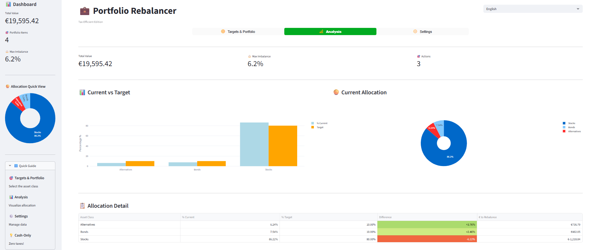
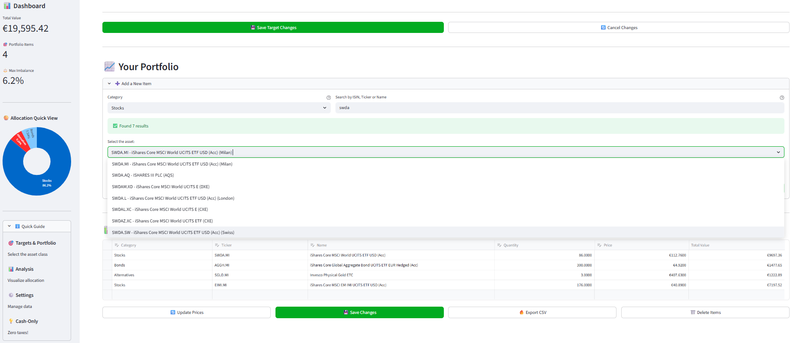
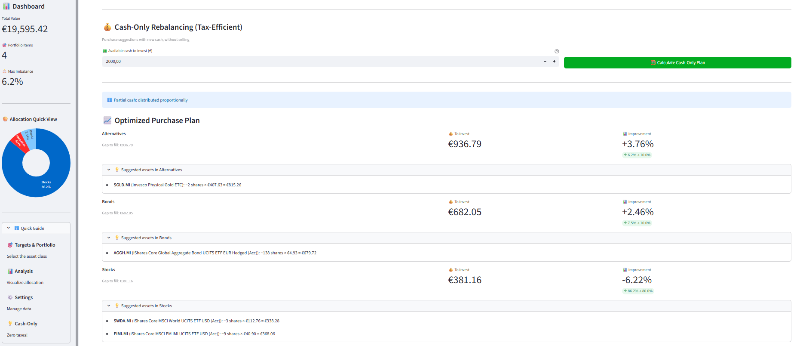

# 💼 Portfolio Rebalancer

> **Tax-efficient portfolio rebalancing tool with cash-only optimization**

[](https://huggingface.co/spaces/waveflow/portfolio-rebalancer)
[](https://www.gnu.org/licenses/agpl-3.0)
[](https://www.python.org/downloads/)

[English](#english) | [Italiano](#italiano)

---

## English 

### 🎯 What is Portfolio Rebalancer?

Portfolio Rebalancer is a **free, open-source tool** that helps investors maintain their target asset allocation efficiently. Unlike traditional rebalancing that requires selling assets (triggering capital gains taxes), our **Cash-Only Rebalancing** feature optimizes new cash investments to bring your portfolio closer to target allocations.

### ✨ Features

#### Core Features (Free & Open Source)
- 🌍 **Global Asset Search** - Search stocks/ETFs via Yahoo Finance (100+ exchanges)
- 📊 **Visual Analytics** - Interactive charts showing current vs target allocation
- 💰 **Cash-Only Rebalancing** - Tax-efficient rebalancing without selling
- 📈 **Traditional Rebalancing** - Classic buy/sell recommendations
- 🔄 **Real-time Prices** - Automatic price updates via Yahoo Finance
- 📁 **Import/Export** - CSV support for portfolio management
- 🌐 **Bilingual** - English and Italian interface
- 🎨 **Professional UI** - Clean, modern interface with sidebar statistics

<p align="center">
  
</p>

---

### 📸 Key Features in Action

#### 1. Easy Asset Search
*Search by ticker (supports Milan, Xetra, London, NYSE...) and get live prices immediately.*
<p align="center">
  
</p>

#### 2. Tax-Efficient Rebalancing
*The "Cash-Only" engine calculates the perfect buy order to fix your allocation without selling.*
<p align="center">
  
</p>

---


### 🚀 Quick Start

#### Try it Online
👉 **[Launch App](https://huggingface.co/spaces/waveflow/portfolio-rebalancer)** - No installation required!

#### Run Locally

```bash
# Clone the repository
git clone https://github.com/prev-creator/portfolio-rebalancer.git
cd portfolio-rebalancer

# Install dependencies
pip install -r requirements.txt

# Run the app
streamlit run app.py
```

### 📖 How to Use

1. **Set Target Allocation**
   - Define your target percentages (e.g., 80% Stocks, 10% Bonds, 10% Alternatives)
   - Total must equal 100%

2. **Add Portfolio Items**
   - Search by ISIN, ticker, or name
   - Add quantity and let the app fetch current prices
   - Supports all Yahoo Finance markets

3. **Analyze Your Portfolio**
   - View current vs target allocation
   - See rebalancing recommendations
   - Use Cash-Only feature for tax-efficient investing

4. **Cash-Only Rebalancing**
   - Enter available cash to invest
   - Get optimized purchase plan
   - No selling = No capital gains taxes!

### 💡 Example Use Case

**Scenario:**
You have a portfolio of **€19,595** and **€2,000** of fresh cash to invest.
Your allocation is drifting from your targets:

| Asset Class | Target | Current | Status |
| :--- | :--- | :--- | :--- |
| 🌍 **Stocks** | 80% | 86.2% | 🔼 Overweight |
| 🛡️ **Bonds** | 10% | 7.5% | 🔻 Underweight |
| 💎 **Alternatives** | 10% | 6.2% | 🔻 Underweight |

**The Problem:**
Stocks have run too much! To fix this perfectly (to get back to 80%), traditional math would force you to **sell** stocks, triggering capital gains taxes 💸.

**The Solution (Cash-Only Mode):**
You don't want to sell. You just want to use your **€2,000** cash intelligently.
The tool calculates exactly how to distribute the new cash to boost the "laggards" (Bonds & Alternatives) and buy just enough Stocks to not dilute them too much.

**Result (as seen in screenshots):**
- 🛒 Buy **€936** of Alternatives (SGLD) → *Pumps it up +3.76%*
- 🛒 Buy **€682** of Bonds (AGGH) → *Pumps it up +2.46%*
- 🛒 Buy **€381** of Stocks (SWDA/EIMI) → *Keeps it balanced*
- **Tax Bill: €0.00** 🎉

*(Note: Market prices and portfolio values in this example are from Jan 25, 2026)**

### 🛠️ Tech Stack

- **Python 3.8+**
- **Streamlit** - Web framework
- **Pandas** - Data manipulation
- **Plotly** - Interactive visualizations
- **yfinance** - Market data
- **Yahoo Finance API** - Asset search

### 📋 Requirements

```
streamlit>=1.28.0
pandas>=2.0.0
yfinance>=0.2.28
plotly>=5.17.0
requests>=2.31.0
streamlit-option-menu>=0.3.6
matplotlib>=3.7.0
```

### 🤝 Contributing

Contributions are welcome! Please feel free to sub a Pull Request.

1. Fork the repository
2. Create your feature branch (`git checkout -b feature/AmazingFeature`)
3. Commit your changes (`git commit -m 'Add some AmazingFeature'`)
4. Push to the branch (`git push origin feature/AmazingFeature`)
5. Open a Pull Request

### 📄 License

This project is licensed under the GNU Affero General Public License v3.0 (AGPLv3) - see the [LICENSE](LICENSE) file for details.

### 🙏 Acknowledgments

- Market data provided by [Yahoo Finance](https://finance.yahoo.com/)
- Built with [Streamlit](https://streamlit.io/)

### 📧 Contact

- **Report Bugs:** [GitHub Issues](https://github.com/prev-creator/portfolio-rebalancer/issues)
- **GitHub:** [@prev-creator](https://github.com/prev-creator)

### ⭐ Star History

If you find this project useful, please consider giving it a star!

---

## Italiano

### 🎯 Cos'è Portfolio Rebalancer?

Portfolio Rebalancer è uno **strumento gratuito e open-source** che aiuta gli investitori a mantenere l'allocazione target del portafoglio in modo efficiente. A differenza del ribilanciamento tradizionale che richiede la vendita di asset (generando tasse sulle plusvalenze), la nostra funzione **Ribilanciamento Cash-Only** ottimizza i nuovi investimenti in liquidità per avvicinare il portafoglio agli obiettivi.

### ✨ Funzionalità

#### Funzionalità Core (Gratuite & Open Source)
- 🌍 **Ricerca Asset Globale** - Cerca azioni/ETF tramite Yahoo Finance (100+ exchange)
- 📊 **Analisi Visuale** - Grafici interattivi che mostrano allocazione attuale vs target
- 💰 **Ribilanciamento Cash-Only** - Ribilanciamento efficiente fiscalmente senza vendite
- 📈 **Ribilanciamento Tradizionale** - Raccomandazioni classiche di acquisto/vendita
- 🔄 **Prezzi Real-time** - Aggiornamento automatico prezzi via Yahoo Finance
- 📁 **Import/Export** - Supporto CSV per gestione portafoglio
- 🌐 **Bilingue** - Interfaccia in Inglese e Italiano
- 🎨 **UI Professionale** - Interfaccia pulita e moderna con statistiche in sidebar

### 🚀 Avvio Rapido

#### Prova Online
👉 **[Avvia App](https://huggingface.co/spaces/waveflow/portfolio-rebalancer)** - Nessuna installazione richiesta!

#### Esegui Localmente

```bash
# Clona il repository
git clone https://github.com/prev-creator/portfolio-rebalancer.git
cd portfolio-rebalancer

# Installa le dipendenze
pip install -r requirements.txt

# Avvia l'app
streamlit run app.py
```

### 📖 Come Usarlo

1. **Imposta Allocazione Target**
   - Definisci le percentuali target (es: 80% Azionario, 10% Obbligazionario, 10% Alternative)
   - Il totale deve essere 100%

2. **Aggiungi Titoli al Portfolio**
   - Cerca per ISIN, ticker o nome
   - Aggiungi quantità e l'app recupera i prezzi correnti
   - Supporta tutti i mercati Yahoo Finance

3. **Analizza il Tuo Portfolio**
   - Visualizza allocazione attuale vs target
   - Vedi raccomandazioni di ribilanciamento
   - Usa la funzione Cash-Only per investimenti efficienti fiscalmente

4. **Ribilanciamento Cash-Only**
   - Inserisci liquidità disponibile da investire
   - Ottieni piano di acquisto ottimizzato
   - Nessuna vendita = Nessuna tassa su plusvalenze!

### 💡 Caso d'Uso di Esempio

**Scenario:**
Hai un portafoglio di **€19.595** e **€2.000** di nuova liquidità.
La tua allocazione sta deviando dai target:

| Asset Class | Target | Attuale | Status |
| :--- | :--- | :--- | :--- |
| 🌍 **Azionario** | 80% | 86,2% | 🔼 Sovrapesato |
| 🛡️ **Obbligazionario** | 10% | 7,5% | 🔻 Sottopesato |
| 💎 **Alternative** | 10% | 6,2% | 🔻 Sottopesato |

**Il Problema:**
L'azionario è salito troppo! Per tornare all'80% perfetto, la matematica tradizionale ti direbbe di **vendere** azioni, pagando tasse sulle plusvalenze 💸.

**La Soluzione (Cash-Only):**
Il tool calcola come distribuire i tuoi **€2.000** per spingere solo gli asset rimasti indietro, avvicinandoti al target senza vendere nulla.

**Risultato:**
- 🛒 Compra **€936** di Alternative (SGLD)
- 🛒 Compra **€682** di Obbligazioni (AGGH)
- 🛒 Compra **€381** di Azionario (SWDA/EIMI)
- **Tasse pagate: €0.00** 🎉

*(Nota: I prezzi di mercato e i valori del portafoglio in questo esempio sono aggiornati al 25 Gen 2026)*

### 📄 Licenza

Questo progetto è distribuito con licenza GNU Affero General Public License v3.0 (AGPLv3) - vedi il file [LICENSE](LICENSE) per dettagli.

### 📧 Contatti

- **Segnala Bug:** [GitHub Issues](https://github.com/prev-creator/portfolio-rebalancer/issues)
- **GitHub:** [@prev-creator](https://github.com/prev-creator)

---

**Made with ❤️ by Andrea**
